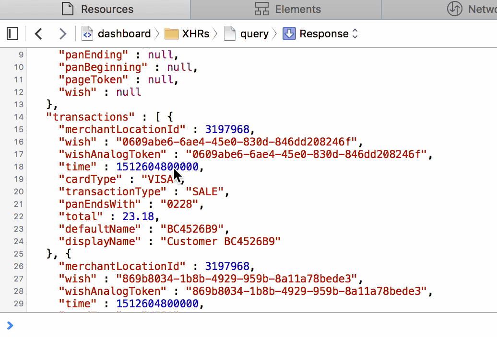
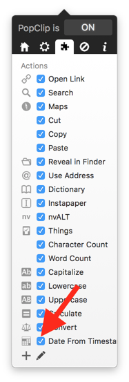

# 'Date From Timestamp' PopClip Extension

This simple [PopClip](http://pilotmoon.com/popclip/) extension quickly converts a JavaScript timestamp (milliseconds since Jan 1 1970) into a human-readable date.

## Installation

> This extension requires a `node` executable in `usr/local/bin`. If you get a `Cannot Install Extension` error saying `No such executable file: /usr/local/bin/node` and you are sure that you have Node installed (ie, running `which node` gives you output), you'll want to set up a symlink to your `node` executable by running `ln -s (which node) /usr/local/bin/node`

1. Download or clone this repo to your computer
2. Double-click the `Date From Timestamp.popclipext` extension to install it in PopClip
3. Confirm that the Date From Timestamp extension is activated:

## Usage

1. Select a JavaScript timestamp (it works with any integer)
2. Click the calendar icon
3. ***Optional:*** Click on the human-readable date to copy it to your clipboard
